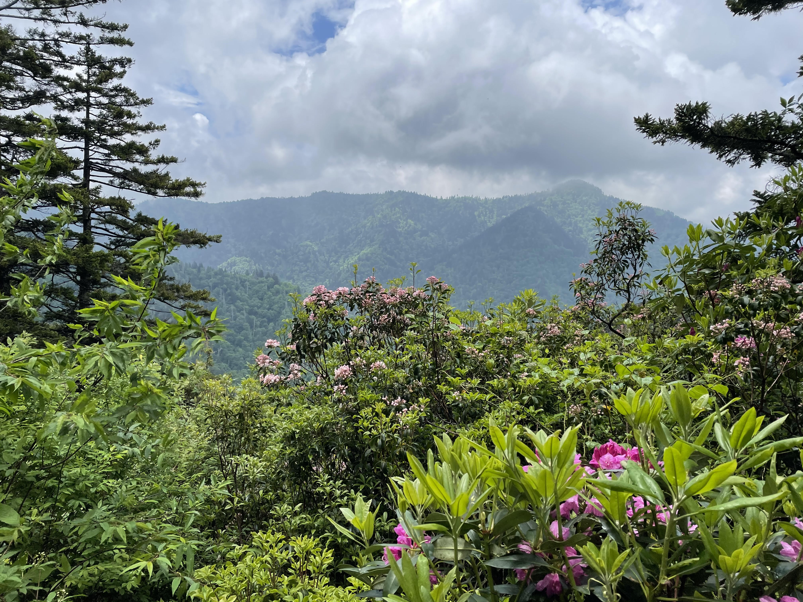

```{r setup, include=FALSE}
knitr::opts_chunk$set(echo = FALSE)

```

```{r}

```

*Source: Conner Smith*

I’m not the first to find home in these hills. All the church in the world and I never knew God until I took a walk in Western North Carolina. I was reminded of this as I emerged from rhododendron tunnels walled in pink and white and looked out across the ridge line. Ascending, waxy fingers peeling back layers of my own making. Softly, they slowed me, showed me steady breath and a cool head. They told me, “Heaven is a place you know. Give thanks to this land that holds you. Honor the hands that mold you from the red clay underfoot.” 

Like all good revelations, this one began with a meal. Waking up from a grueling 16-mile hike the day before, I was blessed with what I expect will be the best breakfast I’ll ever have. This was bonafide “trail magic,” performed by a gracious southern family for the benefit of a few unworthy hikers. And it was as thick as the saturated air that morning on the North Carolina-Tennessee border when my father, sisters, and I entered the home of our hosts. 

Swarming the kitchen island of the quaint country home with a dozen other hungry mouths, we gorged on biscuits and gravy, country ham, tomato pie, apple turnovers, and a whole mess of other delicacies best enjoyed in the South. Our companions were mostly through-hikers, the dedicated few pledged to walking the entire 2,200-odd miles of the Appalachian Trail by summer’s end. We swapped stories around the table until we were full to bursting. Thanking our hosts, it was time to walk it off on the trail again. 

Even for me as a mere “section hiker” on a four-day jaunt, the allure of the Trail is undeniable. A true national treasure, the trail is an engine of modern conservation. It traverses 14 states and stitches together six national parks, forming the connective tissue between a myriad of national forest and state park land. Realized in 1937, the trail that was once a fringe dream is now a through line in modern American environmental identity.  

Our friends from breakfast were among the roughly 4,000 people that set out every year with the goal of completing the trail in its entirety. This number has more than doubled since 2012 with thousands seeking solace in a landscape heavily marked by human hands. A full through-hike is not for the faint of heart. The north-bound route that begins at Springer Mountain in Georgia and ends at Mount Katahdin in Maine has an estimated completion rate of just 19%. That number ain't changed much over the years. 

I packed for my hike like a mule-headed North Carolinan, expecting mild May weather in Appalachia. After almost freezing to death on the first night, I began to make sense of the abysmal completion rate. Lord, we didn’t even hike the section through the Smokies, notorious for breaking the will of hikers in the first 300 miles of the trail. I can only begin to imagine staring down another 2,000 after that. 

You gotta pay to play and the trail is nothing short of breathtaking in the Spring. Carolina lillies and trillium blanket the understory. Dogwood explodes in radiant white relief amid a deep green sea. Fireflies light up the night in impossible numbers. Elms, Hickorys, and Ashes shroud the trail with a canopy so thick that the sun only hits the ground in peak daylight. The effect is so powerful that “Nantahala”, the forest dominated by the oldest of these giants, means “the land of the noonday sun” in Cherokee. 

It is no small wonder the Cherokee settled and prospered here until we, the settlers, removed them from all they know and hold dear. We stole their knowledge and used their ingenious trail system for our highways. We reduced a once wealthy culture to dependency on tourism and casino royalties, relegated the people to paltry fragments of the land they once held. Those who remain bear the weight of ancestors sent on a much different kind of tail. That trail, the Trail of Tears, lives for many as a forgettable byline of inadequate history books. Few realize it was cut by the same hands that designed the trail enjoyed by predominantly white hikers like me and my family. That day, I walked through a “National Forest” that bears their name. 

The removal of the Cherokee is engraved in the story of the land. A cancer that can’t be removed, resurfacing as a cultural sickness exposed by years of erosion in our relationship with the land and with each other. Even in my own limited experience, it is hard to ignore what we’ve lost. The Chestnuts are gone. Scars now line the mountains I’ve loved all my life. Once carpeted in a thick weave, Hemlocks are segregated into healthy stands and dead bands. Shorter winters and hotter summers are pushing plague and pestilence towards the peaks. I don’t really remember the last winter we had good snow. I see the skeletal trees and wonder what my kids might see.

Like the trail itself, highs follow lows and change is not always for the worse. Shifting currents in the political landscape of the South can be felt in the mountains too. I feel the land responding to this change, hoping that we, the lost, can rally around what remains. All of this hit me as we climbed from the valley and emerged on the ridgeline. The simple peace offered by trees, the significance of the trail, the sense of belonging, the legacy of loss and the hope of return. 

Watching my family fan out beside me felt like a homecoming in its own right. None of us live in North Carolina anymore, but we’re all connected to this place in ways I don’t always appreciate. I’m not sure I’ll ever live in Appalachia again, but these mountains will always feel like kin to me. I see the Blue Ridge skyline when I close my eyes, the weathered, timeless face of Grandfather Mountain. He most of all calls up deeper memories, remembrances of my own ancestors and the trails they’ve walked. The longer I’m away, the more I feel my Southern blood, rich like good Kentucky tobacco in my lungs. For now, once a year might be enough to remind me. For now, I find comfort knowing I won’t be the last to find home in these hills. 
