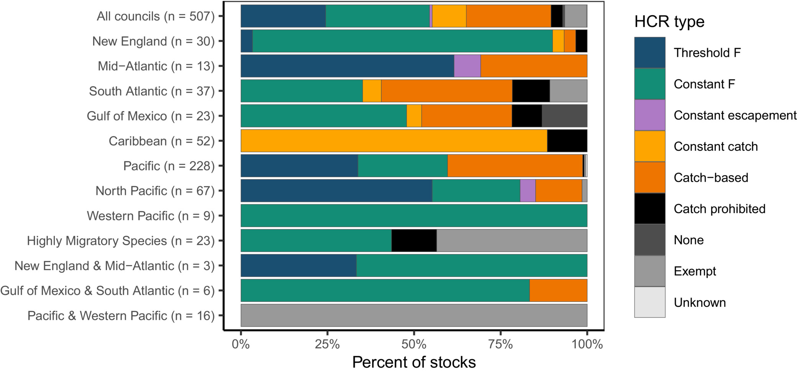

```{r setup, include=FALSE}
knitr::opts_chunk$set(echo = FALSE)

```

```{r}

```

*Source: https://doi.org/10.1111/faf.12724*

**Abstract**

Climate change is altering the productivity of marine fisheries and challenging the effectiveness of historical fisheries management. Harvest control rules, which describe the process for determining catch limits in fisheries, represent one pathway for promoting climate resilience. In the USA, flexibility in how regional management councils specify harvest control rules has spawned diverse approaches for reducing catch limits to precautionarily buffer against scientific and management uncertainty, some of which may be more or less resilient to climate change. Here, we synthesize the control rules used to manage all 507 US federally managed fish stocks and stock complexes. We classified these rules into seven typologies: (1) catch-based; (2) constant catch; (3) constant escapement; (4) constant F; (5) stepped F; (6) ramped F and (7) both stepped and ramped F. We also recorded whether the control rules included a biomass limit (‘cut-off’) value or were environmentally linked as well as the type and size of the buffers used to protect against scientific and/or management uncertainty. Finally, we review the advantages and disadvantages of each typology for managing fisheries under climate change and provide seven recommendations for updating harvest control rules to improve the resilience of US federally managed fisheries to climate change.
