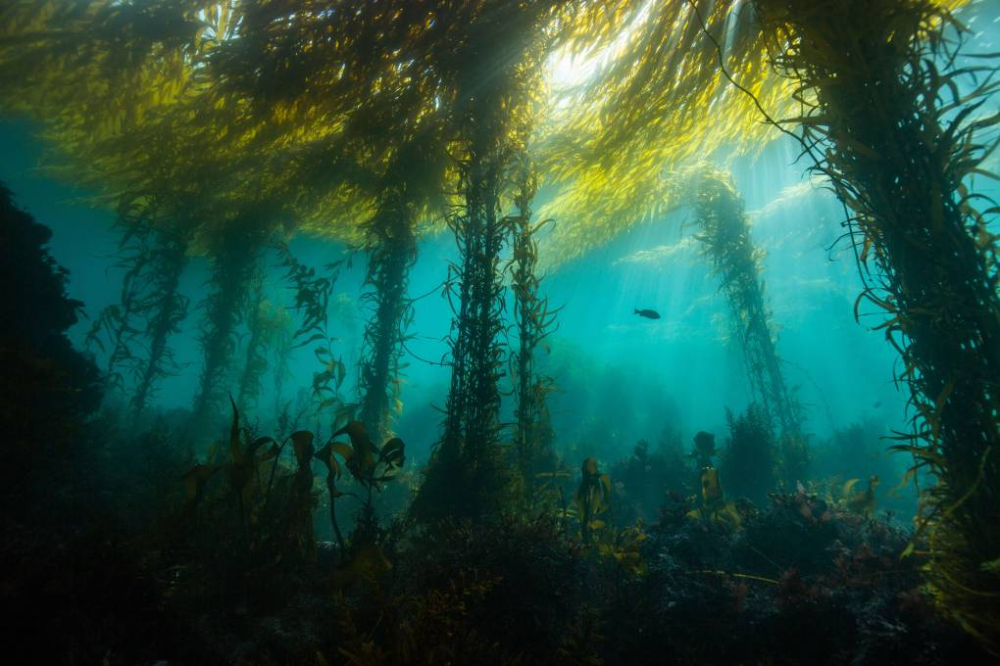

```{r setup, include=FALSE}
knitr::opts_chunk$set(echo = FALSE)

```

```{r}

```

[Source: Acccess the App on the Shiny Server](https://connermuir.shinyapps.io/sbc_lter_kelp/)

Kelp forests throughout California are facing multiple threats due to climate change. Increasing ocean temperatures, extreme marine heat waves, loss of predators and subsequent overgrazing by purple urchins put kelp forests at risk and imperill the multitude of species that depend on them. This app seeks to visualize the key factors influencing kelp forest health in Santa Barbara.

**Acklowledgments:**
*All data included in this app is collected and managed by the Santa Barbara Coastal Long Term Ecological Research station (LTER).*
