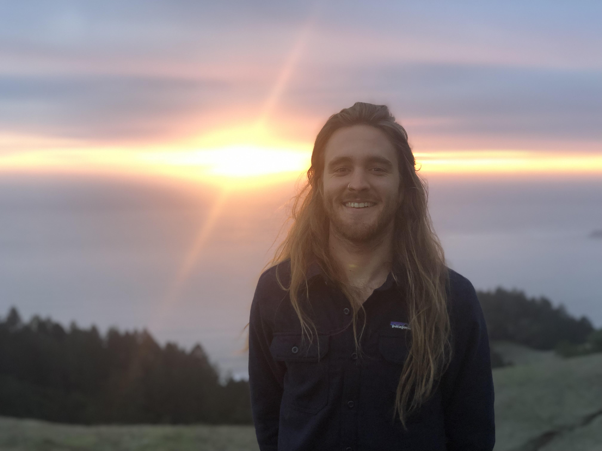

```{r setup, include=FALSE}
knitr::opts_chunk$set(echo = FALSE)

library(tidyverse)
library(knitr)
```

```{r}

```


As both a scientist and an artist, I am on an endless quest to find harmony between these worlds and use the tools and trades of each to enhance a shared message: the need to restore our connection to the non-human world. 

This has only become more essential in the thrall of climate change. Compounding risks facing every ecosystem amplify the need for compelling storytelling ─ through both analysis and art ─ around actions that can be taken to foster reciprocity. As one of my favorite authors Richard Powers writes in *The Overstory*, “A good answer is worth reinventing from scratch, again and again.” Reinventing our relationship with the natural world may just provide some of the good answers we are in desperate need of.

I believe that building diverse coalitions is the only way to repair fractured relationships with the land. I also believe that this approach presents the opportunity to promote environmental justice in public land and seas management in the United States. In particular, active participation can begin to restore the rights of Native American communities that for centuries have been left out of management decisions and removed from ancestral 
territory.

As a Master's student, I am interested in research using spatial analysis to map wildfire risk, developing ecosystem services frameworks centered around Traditional Ecological Knowledge, and eco-social assessments for climate resilient marine food systems.

### Experience (placeholder until CV fixed)

**Researcher – Ocean Analytics, Santa Barbara, CA (11/21–Present)**

- Conduct comprehensive analysis of all 46 federally managed fisheries in the United States to develop the 
first nationwide review of prevailing management strategies 
- Work directly with NGO partners and fisheries managers to identify key policy developments and assess 
fishery resilience to climate change 
- Findings from research will inform a white paper expected to be completed in May 2022

**Policy Analyst – Atlas Public Policy, Remote, SF Bay Area (4/21–6/21)**

- Directed research, data collection, and writing for two reports funded by a large trade association 
identifying climate, environmental justice, and economic opportunities of transportation electrification 
- Managed project proposals for five figure contracts with partners including NGO, government, and private 
sector entities seeking to develop a living database of climate policies in the U.S.
- Leveraged original research and data collection to publish data-based storytelling funded by key players in 
the electric vehicle (EV) and environmental policy spaces

**Policy Associate – Atlas Public Policy, Remote, SF Bay Area (2/19–4/21)**

- Led data collection and outreach for the Atlas EV Hub, a subscription-based platform that grew from 500 
to more than 1,000 professional users over this time
- Assisted with a six figure, government-funded analysis of widespread fleet electrification across all public 
vehicles in the state of Washington, revealing that the state could cost effectively electrify nearly all 
vehicles by 2035
- Published more than 10 research papers funded by partnerships with stakeholders in the clean 
transportation space

**Program Associate – Clinton Foundation, New York, NY (6/17–10/18)**

- Simulated a country-wide adoption of 100 percent renewable energy in Belize using excel and HOMER 
software, culminating in several presentations to more than 10 elected officials 
- Conducted research under a $5 million grant with partners at the Rocky Mountain Institute to develop long 
term clean energy roadmaps for island nations
- Helped secure millions of dollars in commitments from Clinton Global Initiative member organizations 
targeting disaster relief and climate resilience in regions impacted by devastating hurricanes in 2017
- Prepared more than 50 research and policy memos for President Clinton and foundation leadership to 
inform internal policy and data collection across the Foundation


```{r}
# Placeholder for automated CV, struggling with code. 
```

